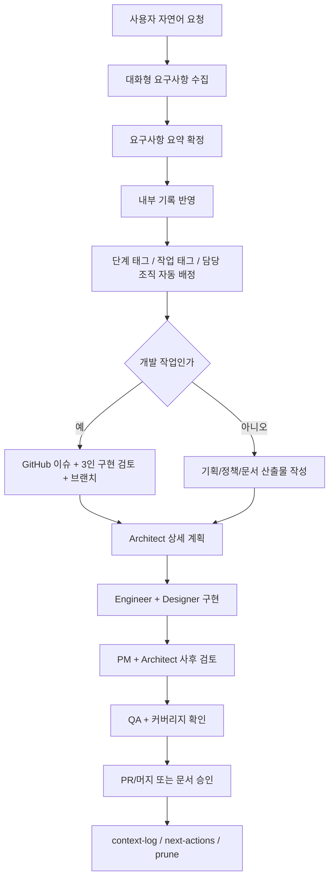

# Repeato Workflow README

## 목적
- 이 문서는 Repeato 저장소에서 작업을 어떻게 시작하고, 어떤 순서로 요구사항을 정리하고, 언제 개발 절차로 넘어가는지 빠르게 이해시키는 진입 문서다.
- 확정 정책과 상세 절차의 단일 기준은 계속 `doc/*` 와 `doc/work/*` 이며, 이 README는 시작 방법과 자동 진행 규칙을 설명하는 안내서다.

## 어떻게 시작하나
이 workflow는 문서를 먼저 쓰는 방식이 아니라, 사용자와의 대화로 시작한다.

예를 들어 사용자가 이렇게 말하면 된다.
- `기능 추가를 하고 싶은데, 이번 기능은 marketplace 에서 학습 데이터를 받는 기능이야`
- `Today 탭에서 목표 카드 수를 바꾸고 싶어`
- `학습 정책을 수정하고 싶은데 오답 재노출 규칙을 더 공격적으로 바꾸고 싶어`

그러면 에이전트는 바로 구현으로 들어가지 않고, 먼저 대화로 아래를 정리한다.
- 목표
- 사용자 가치
- 범위
- 비범위
- 제약사항
- 성공 조건

요구사항이 충분히 정리되면 그때 내부적으로 문서에 기록하고, 다음 단계를 자동으로 진행한다.

## 전체 흐름

## 단계별 안내
| 단계 | 하는 작업 | 필요한 리소스 | 기본 에이전트/조직 |
| --- | --- | --- | --- |
| 1. 대화형 요청 접수 | 사용자의 자연어 요청을 받고 필요한 질문으로 요구사항을 정리한다 | 사용자 대화, `doc/reference/repeato-workflow.md`, `doc/reference/plan-checklist.md` | PM, Architect |
| 2. 요구사항 확정 | 목표, 범위, 비범위, 성공 조건, 제약사항을 합의 가능한 수준으로 정리한다 | `doc/reference/project-context.md`, `doc/reference/plan-checklist.md` | PM, Architect, 필요시 Designer |
| 3. 내부 기록 반영 | 정리된 요구사항만 `doc/context/context-inbox.md`와 `doc/context/context-log.md`에 반영한다 | `doc/context/context-inbox.md`, `doc/context/context-log.md`, `doc/reference/context-workflow.md` | Workflow Enablement, PM |
| 4. 자동 분류/배정 | 요구사항 내용을 기준으로 단계 태그, 작업 태그, 담당 조직을 자동 선택한다 | `doc/work/repeato-delivery-organization-v1.md`, `doc/agents/app-agent-organization.md`, `doc/agents/repeato-agent-extension.md` | PM, Architect, Workflow Enablement |
| 5. 개발 추적 시작 | 개발 작업이면 `이슈 -> 브랜치 -> 구현 -> PR -> QA -> 머지` 절차를 시작한다 | `doc/work/repeato-github-tracking-workflow-v1.md`, GitHub 이슈/브랜치 규칙 | Development Lead, Feature Engineer, Integration Engineer |
| 6. 구현/문서 반영 | 코드와 요구사항 문서를 함께 수정하고 계획 밖 변경은 재검토한다 | 관련 구현 파일, 관련 `doc/work/*`, 테스트 파일 | Engineer, Designer, Architect |
| 7. 사후 검토/QA | 기획 적합성, 회귀, 커버리지 70% 이상 유지 여부를 확인한다 | `flutter analyze`, `flutter test --coverage`, QA 시나리오 문서 | PM, Architect, QA |
| 8. 종료/이월 | 결과를 로그에 남기고 미완료 항목은 next-actions로 넘긴 뒤 inbox를 정리한다 | `doc/context/context-log.md`, `doc/context/next-actions.md`, `doc/context/context-prune-rules.md` | PM, Workflow Enablement, QA |

## 자동 배정은 어떻게 되나
태그와 담당 조직은 사용자가 직접 고르지 않는다. 요구사항이 정리되면 에이전트가 [doc/work/repeato-delivery-organization-v1.md](doc/work/repeato-delivery-organization-v1.md)를 기준으로 자동 배정한다.

예시:
- 새 탭/화면/UX 기능 요청:
  - `#STAGE-B` 또는 `#STAGE-D`
  - `#TASK-TAB`
  - `#ORG-PM`, `#ORG-DESIGN`, `#ORG-FE`, `#ORG-QA`
- 학습 정책 변경:
  - `#STAGE-B`
  - `#TASK-LEARNING`
  - `#ORG-PM`, `#ORG-EDU`, `#ORG-COG`, `#ORG-ARCH`
- SQLite/상태 모델/저장 구조:
  - `#STAGE-C`
  - `#TASK-APP`, `#TASK-DATA`
  - `#ORG-ARCH`, `#ORG-FE`, `#ORG-DATA`
- 동기화/결제/가져오기/서버 연동:
  - `#STAGE-C` 또는 `#STAGE-E`
  - `#TASK-SYNC`, `#TASK-COMMERCE`, `#TASK-SERVERLESS`
  - `#ORG-DATA`, `#ORG-SEC`, `#ORG-SRE`, 필요시 `#ORG-BE`
- workflow 자체 변경:
  - `#STAGE-C`
  - `#TASK-WORKFLOW`
  - `#ORG-WF-ARCH`, `#ORG-WF-LIB`, `#ORG-WF-AUTO`

## 단계별로 자주 읽는 문서
| 상황 | 우선 읽을 문서 |
| --- | --- |
| Repeato 작업의 기준 이해 | `doc/reference/repeato-workflow.md` |
| 공통 컨텍스트 절차 확인 | `doc/reference/context-workflow.md` |
| 자동 조직/태그 배정 기준 | `doc/work/repeato-delivery-organization-v1.md` |
| 개발 이슈/브랜치/PR 절차 | `doc/work/repeato-github-tracking-workflow-v1.md` |
| 여러 탭 병렬 조율 | `doc/work/repeato-tab-orchestration-v1.md` |
| skill/plugin 추출 경계 판단 | `doc/work/repeato-workflow-extraction-v1.md` |
| 학습 정책 검토 | `doc/agents/repeato-agent-extension.md` |

## `doc/work` 와 `skills` 의 경계
| 위치 | 넣어야 하는 것 | 이유 |
| --- | --- | --- |
| `README.md` | 빠른 진입 설명, 그림, 시작 방식 | 사람이 가장 먼저 읽는 진입점이어야 하기 때문 |
| `doc/work/*` | 버전이 있는 정책, 조직 규칙, 회의 결과, 추적 절차, 결정 기록 | Repeato 전용의 권위 있는 산출물 저장소이기 때문 |
| `skills/context-workflow` | 다른 저장소에도 재사용 가능한 공통 workflow | 제품 비종속 재사용 자산이기 때문 |
| `skills/repeato-workflow` | Repeato 저장소에서 반복 실행하는 얇은 Codex 지침 | 저장소 안에서 반복 호출되는 실행 가이드를 줄이기 좋기 때문 |

결론:
- `doc/work` 의 상세 절차 문서를 통째로 skill로 옮기는 것은 맞지 않다.
- 대신 `doc/work` 는 권위 문서로 유지하고, 자주 반복되는 실행 순서만 `skills/repeato-workflow` 로 얇게 추출하는 구성이 가장 안전하다.

## `doc` 폴더 역할
| 위치 | 역할 |
| --- | --- |
| `doc/agents/*` | agent 역할, 협업 규칙, 제품 전용 확장 |
| `doc/reference/*` | 오래 유지되는 기준 문서와 workflow |
| `doc/context/*` | inbox/log/next-actions/prune 같은 세션 기록 |
| `doc/work/*` | 여러 이슈에서 재사용되는 로컬 산출물 |
| `doc/work/archive/*` | 활성 사용이 끝난 로컬 문서 |

추가 원칙:
- 기능 단위 spec과 진행 메모는 GitHub issue/PR을 먼저 사용한다.
- GitHub가 기준 저장소가 된 뒤 로컬 문서가 필요 없으면 `doc/work/archive/`로 내리거나 제거한다.

## 추천 시작 방식
1. 사용자가 자연어로 요청을 말한다.
2. 에이전트가 질문을 통해 요구사항을 정리한다.
3. 요구사항이 정리되면 내부 문서에 기록한다.
4. 단계 태그, 작업 태그, 담당 조직은 자동으로 배정한다.
5. 개발 작업이면 GitHub 절차로, 문서/정책 작업이면 산출물 문서 갱신으로 이어진다.
